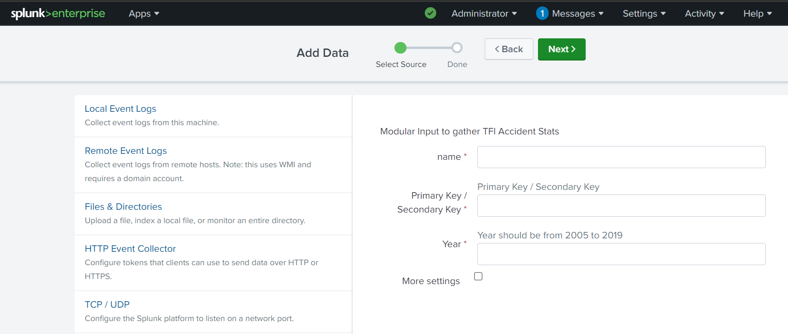

Release Notes

Splunk Modular Input for TFL_AccidentStats

Version 1.0.0: October_11_2024

TFL_AccidentStats: 

    Functionality: 
        Fetches accident statistics from the TFL (Transport for London) API.

    User Interface:

     name: NAME_OF_THE_INPUT
     Primary / Secondary Key: YOUR_PRIMARY_OR_SCENODARY_KEY
     Year: YEAR

     

    1. name - User can specify the name of the input thay want to create.
    2. Primary / Secondary Key - TFL api key 
    3. Year - Year for which the user want to fetch the accident statistics for. Year value should be between 2005 to 2019.